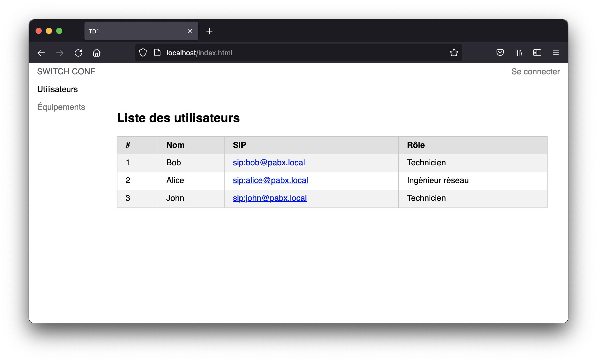
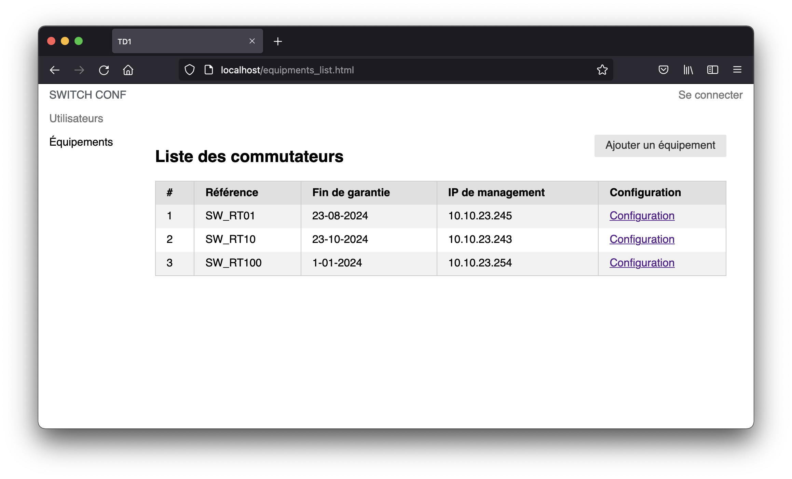
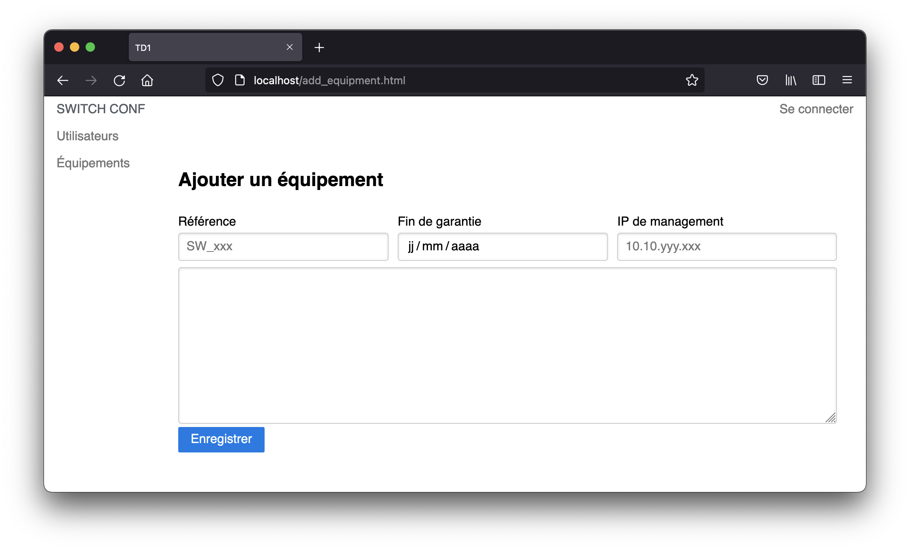
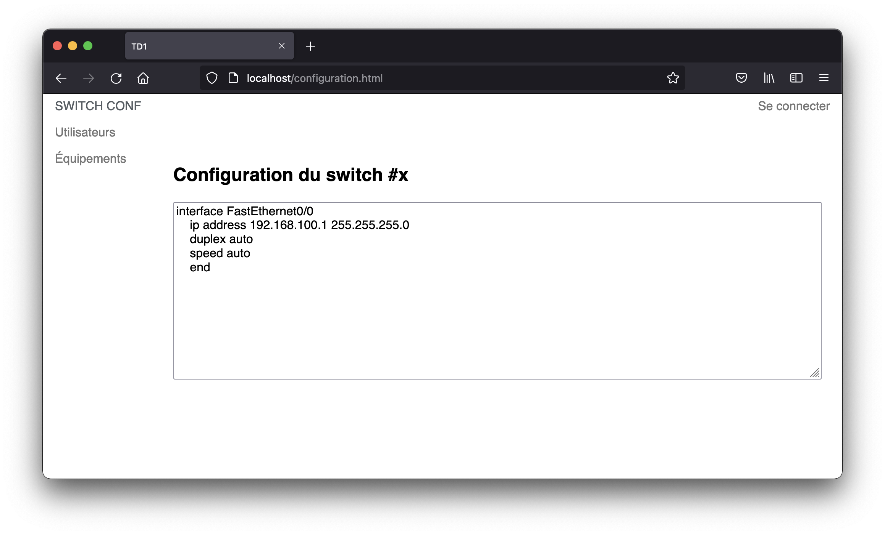
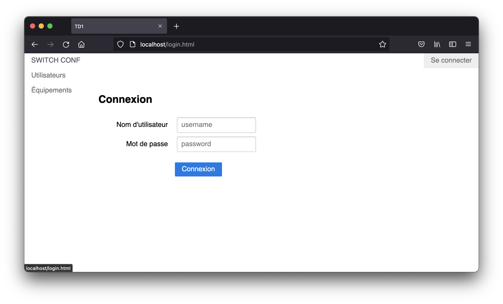

# Développement Web

Initiation au développement Web

<div class="abs-br m-6 flex gap-2">
  <a href="https://github.com/Veryloop/but-rt-s2-r209" target="_blank" alt="GitHub"
    class="text-xl icon-btn opacity-50 !border-none !hover:text-white">
    <carbon-logo-github />
  </a>
</div>

---
src: slides/summary/sommaire.md
---

---
src: slides/summary/cours.md
---

---
src: slides/summary/td.md
---

---
src: slides/summary/tp.md
---


---
layout: center
---
# HTTP

---
src: slides/http/osi.md
---

---
src: slides/http/http.md
---

---
src: slides/http/url.md
---

---
src: slides/http/get.md
---

---
src: slides/http/methodes.md
---

---
src: slides/http/codes_retours.md
---

---
src: slides/http/codes_retours_zoom.md
---

---
src: slides/http/headers.md
---

---
src: slides/http/cookies.md
---

---
src: slides/http/clients_serveurs.md
---

---
src: slides/http/curl.md
---

---
src: slides/http/browser.md
---

---
clicks: 7
src: slides/http/flux_requete.md
---

---
src: slides/backend/ws/intro.md
---

---
layout: center
class: text-center
---
# Frontend
Interface utilisateur
---
src: slides/frontend/intro.md
---

---
src: slides/frontend/html/balises.md
---

---
src: slides/frontend/html/imbrications.md
---

---
src: slides/frontend/css/intro.md
---

---
src: slides/frontend/css/pure.md
---

---
src: slides/frontend/js/intro.md
---

---
src: slides/frontend/js/link.md
---

---
src: slides/frontend/js/variable.md
---

---
src: slides/frontend/js/variable_code.md
---

---
src: slides/frontend/js/condition.md
---

---
src: slides/frontend/js/condition_swc.md
---

---
src: slides/frontend/js/boucle.md
---

---
src: slides/frontend/js/fonction.md
---

---
src: slides/frontend/js/window.md
---

---
src: slides/frontend/js/window_2.md
---

---
src: slides/frontend/js/dom_def.md
---

---
src: slides/frontend/js/dom.md
---

---
src: slides/frontend/js/async.md
---

---
src: slides/frontend/js/fetch.md
---

---
layout: center
class: text-center
---
# Backend
La partie que l’utilisateur ne voit pas
---
src: slides/backend/intro.md
---

---
src: slides/backend/php_runtime.md
---

---
src: slides/backend/php_bdd.md
---

---
src: slides/backend/php/intro.md
---

---
src: slides/backend/php/communaute.md
---

---
src: slides/backend/php/fonctionnalites.md
---

---
src: slides/backend/php/variables.md
---

---
src: slides/backend/php/variables_const.md
---

---
src: slides/backend/php/types_liste.md
---

---
src: slides/backend/php/types_bool.md
---

---
src: slides/backend/php/types_nombre.md
---

---
src: slides/backend/php/types_string.md
---

---
src: slides/backend/php/types_array.md
---

---
src: slides/backend/php/types_other.md
---

---
src: slides/backend/php/operateur.md
---

---
src: slides/backend/php/operateur_comp.md
---

---
src: slides/backend/php/fonctions.md
---

---
src: slides/backend/php/if.md
---

---
src: slides/backend/php/switch.md
---

---
src: slides/backend/php/for.md
---

---
src: slides/backend/php/shell.md
---

---
src: slides/backend/php/pdo_conn.md
---

---
src: slides/backend/php/pdo_select.md
---

---
src: slides/backend/php/pdo_insert.md
---

---
src: slides/backend/php/pdo_update.md
---

---
src: slides/backend/php/pdo_delete.md
---

---
src: slides/backend/php/script.md
---

---
src: slides/backend/php/session.md
---

---
src: slides/backend/php/form_get.md
---

---
src: slides/backend/php/form_post.md
---

---
src: slides/backend/php/ws.md
---

---
src: slides/backend/php/poo.md
---

---
src: slides/backend/php/twig.md
---

---
layout: center
---
# Sécurité

---

# Sensibilisation à la sécurité du Web : XSS

---

# Sensibilisation à la sécurité du Web : SQLi

---
layout: center
---
# TD

---

# TD1 : Mise en place de l'environnement
VM / VSCode / Firefox

- Accès VM : https://195.220.217.51:8006/
- Documentation PureCSS : https://purecss.io/

Changer le propriétaire du répertoire <kbd>/var/www/html</kbd>
```sh
sudo chown -R etudiant:etudiant /var/www/html
```

---

# TD1 : Développement de l'interface Web


---

# TD1 : Développement de l'interface Web


---

# TD1 : Développement de l'interface Web


---

# TD1 : Développement de l'interface Web


---

# TD1 : Développement de l'interface Web


---

# TD2 : 

---

# TD3 : 

---

# TD4 : 

---
layout: center
class: text-center
---

# Initiation au développement Web

[GitHub](https://github.com/Veryloop/but-rt-s2-r209)

Sources: 
- https://www.php.net
- https://developer.mozilla.org
- https://grafikart.fr
